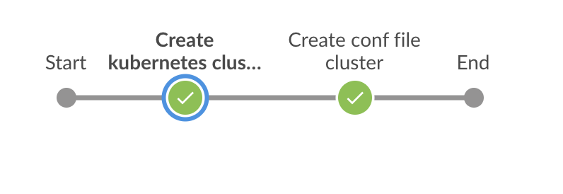
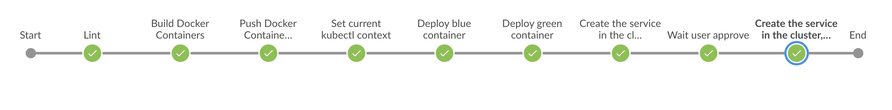

# Udacity - Cloud DevOps Engineer Capstone Project

## Project Overview

In this project I applied the skills and knowledge which were developed throughout the Cloud DevOps Nanodegree program. These include:

* Working in AWS
* Using Jenkins to implement Continuous Integration and Continuous Deployment
* Building pipelines
* Working with Ansible and CloudFormation to deploy clusters
* Building Kubernetes clusters
* Building Docker containers in pipelines

---

## About Project

I developed a CI/CD pipeline for a basic website that deploys to a cluster in Amazon EKS whith Blue/Green Deployment :

* master branch : Create Amazon EKS Cluster Pipeline

* Deployment branch : CI/CD pipeline whith Blue/Green Deployment

## Project Requirement:

* Jenkins
* Blue Ocean Plugin in Jenkins
* Pipeline-AWS Plugin in Jenkins
* Docker
* Pip
* AWS Cli
* Eksctl
* Kubectl

## Authors

* **Mohamed BOUSETTA MAHJOUB** - *Initial work* - [MedMahj](https://github.com/MedMahj/)
